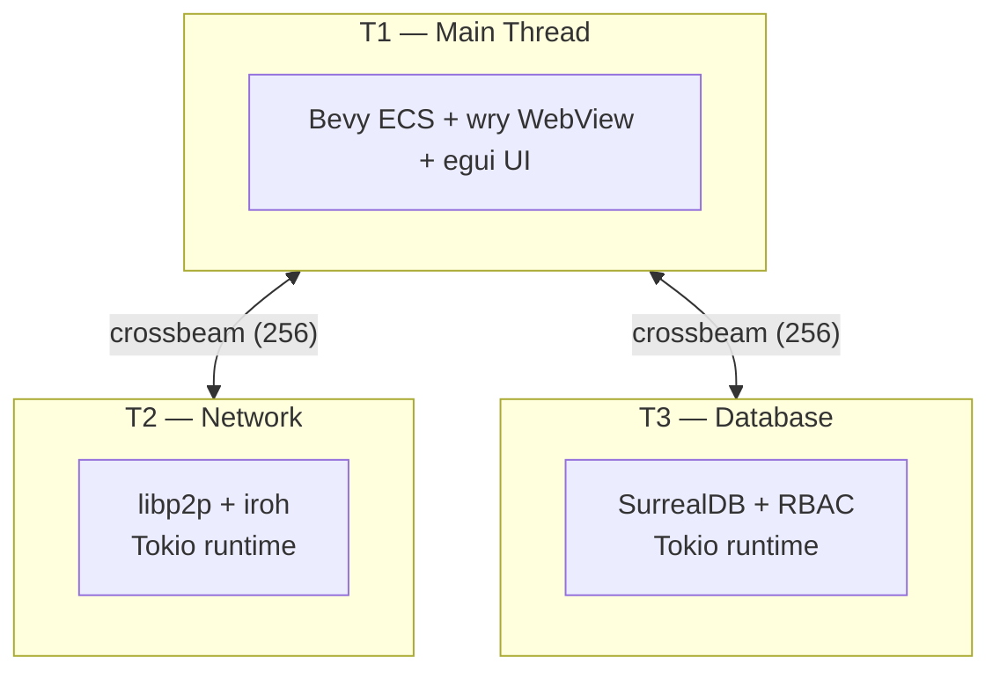
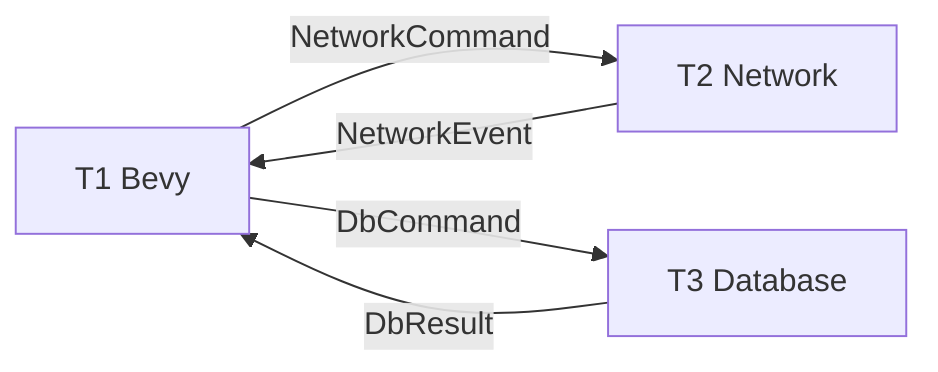

# FractalEngine Architecture Diagrams

Visual guide to FractalEngine's architecture, data flows, and component interactions using Mermaid diagrams. Each diagram is kept focused on a single concern — see the individual files for full detail.

---

## Table of Contents

- [1. System Overview](#1-system-overview)
- [2. Startup Sequence](#2-startup-sequence)
- [3. Channel Bridge](#3-channel-bridge)
- [4. Identity & Authentication](#4-identity--authentication)
- [5. Database Schema](#5-database-schema)
- [6. Network Topology](#6-network-topology)
- [7. Asset Pipeline](#7-asset-pipeline)
- [8. WebView Architecture](#8-webview-architecture)
- [9. Sync & Caching](#9-sync--caching)
- [10. Crate Dependencies](#10-crate-dependencies)
- [11. User Interaction Flows](#11-user-interaction-flows)

---

## 1. System Overview

**File:** [diagrams/01-system-overview.md](diagrams/01-system-overview.md)

The three-thread topology — T1 (Bevy + wry), T2 (libp2p + iroh), T3 (SurrealDB) — connected by bounded crossbeam channels. Shows all major subsystems and their thread affinity.

---

## 2. Startup Sequence

**File:** [diagrams/02-startup-sequence.md](diagrams/02-startup-sequence.md)

The initialization order from binary launch to Bevy event loop: logging setup, channel creation, thread spawning (T2, T3), SurrealDB schema application, Bevy app construction, and `app.run()`.

---

## 3. Channel Bridge

**File:** [diagrams/03-channel-bridge.md](diagrams/03-channel-bridge.md)

All 8 typed crossbeam channels that form the inter-thread communication layer. Includes the `NetworkCommand`/`NetworkEvent` and `DbCommand`/`DbResult` enum definitions with class diagrams.

---

## 4. Identity & Authentication

**File:** [diagrams/04-identity-auth-flow.md](diagrams/04-identity-auth-flow.md)

Three sequence diagrams covering:
- **Key generation** — first-launch Ed25519 keypair creation, OS keychain storage, DID:key derivation
- **Peer authentication** — handshake protocol, JWT issuance, session cache with 60s TTL
- **Session revocation** — signed revocation broadcast via iroh-gossip in <5 seconds

---

## 5. Database Schema

**File:** [diagrams/05-database-schema.md](diagrams/05-database-schema.md)

Entity-relationship diagram for all SurrealDB tables: `petal`, `room`, `model`, `role`, `op_log`. Includes the RBAC permission model (public/custom/admin hierarchy) and the immutable op-log write flow.

---

## 6. Network Topology

**File:** [diagrams/06-network-topology.md](diagrams/06-network-topology.md)

Three diagrams covering:
- **Peer discovery** — Kademlia DHT (WAN) + mDNS (LAN) + iroh relay fallback
- **Data distribution layers** — iroh-blobs (assets), iroh-gossip (events), iroh-docs (state)
- **Peer connection lifecycle** — from DHT lookup to authenticated real-time sync

---

## 7. Asset Pipeline

**File:** [diagrams/07-asset-pipeline.md](diagrams/07-asset-pipeline.md)

Three diagrams covering:
- **GLTF ingestion** — validation, BLAKE3 hashing, storage, iroh-blobs publication
- **P2P distribution** — content-addressed fetch with local cache (2GB, LRU, 7-day eviction)
- **Dead-reckoning** — transform prediction for 60-90% bandwidth reduction

---

## 8. WebView Architecture

**File:** [diagrams/08-webview-architecture.md](diagrams/08-webview-architecture.md)

Three diagrams covering:
- **Browser overlay system** — wry integration, trust bar, CSP enforcement
- **IPC command flow** — typed `BrowserCommand`/`BrowserEvent` enum dispatch
- **Security layers** — URL denylist (localhost, RFC 1918), CSP headers, no raw eval

---

## 9. Sync & Caching

**File:** [diagrams/09-sync-and-caching.md](diagrams/09-sync-and-caching.md)

Three diagrams covering:
- **Petal replication** — iroh-docs range reconciliation (delta only)
- **Caching architecture** — per-Petal SurrealDB namespace, BLAKE3-indexed assets, persistence tiers
- **Reconnection reconciliation** — Lamport clock comparison, delta application

---

## 10. Crate Dependencies

**File:** [diagrams/10-crate-dependencies.md](diagrams/10-crate-dependencies.md)

Two diagrams:
- **Internal crate graph** — how the 10 workspace crates depend on each other, color-coded by role
- **External dependency map** — grouped by category (engine, P2P, data, crypto, async, util)

---

## 11. User Interaction Flows

**File:** [diagrams/11-user-interaction-flow.md](diagrams/11-user-interaction-flow.md)

Three end-to-end flows:
- **Operator creates a Petal** — from UI click through SurrealDB write to DHT publication
- **Visitor enters a Petal** — DHT lookup, auth handshake, state sync, asset fetch, 3D render
- **Model placement** — GLB upload, validation, content addressing, peer distribution

---

## Diagram Legend

| Symbol | Meaning |
|---|---|
| Rectangle | Process or component |
| Cylinder | Database or persistent store |
| Diamond | Decision point |
| Solid arrow | Direct data flow |
| Dashed arrow | Fallback / optional path |
| `PK` / `FK` / `UK` | Primary key / Foreign key / Unique key |
| Subgraph | Logical grouping or thread boundary |
