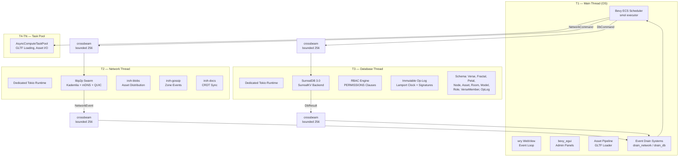

# System Overview

High-level view of FractalEngine's runtime architecture — the three-thread topology with all major subsystems.

```mermaid
graph TB
    subgraph T1["T1 — Main Thread (OS)"]
        Bevy[Bevy ECS Scheduler<br/>smol executor]
        Wry[wry WebView<br/>Event Loop]
        UI[bevy_egui<br/>Admin Panels]
        Renderer[Asset Pipeline<br/>GLTF Loader]
        Drain[Event Drain Systems<br/>drain_network / drain_db]
    end

    subgraph T2["T2 — Network Thread"]
        Tokio2[Dedicated Tokio Runtime]
        Libp2p[libp2p Swarm<br/>Kademlia + mDNS + QUIC]
        Blobs[iroh-blobs<br/>Asset Distribution]
        Gossip[iroh-gossip<br/>Zone Events]
        Docs[iroh-docs<br/>CRDT Sync]
    end

    subgraph T3["T3 — Database Thread"]
        Tokio3[Dedicated Tokio Runtime]
        Surreal[SurrealDB 3.0<br/>SurrealKV Backend]
        RBAC[RBAC Engine<br/>PERMISSIONS Clauses]
        OpLog[Immutable Op-Log<br/>Lamport Clock + Signatures]
        Schema[Schema: Verse, Fractal, Petal,<br/>Node, Asset, Room, Model,<br/>Role, VerseMember, OpLog]
    end

    subgraph T4["T4-TN — Task Pool"]
        AsyncPool[AsyncComputeTaskPool<br/>GLTF Loading, Asset I/O]
    end

    Bevy -->|NetworkCommand| Ch1[crossbeam<br/>bounded 256]
    Ch1 --> Libp2p
    Libp2p -->|NetworkEvent| Ch2[crossbeam<br/>bounded 256]
    Ch2 --> Drain

    Bevy -->|DbCommand| Ch3[crossbeam<br/>bounded 256]
    Ch3 --> Surreal
    Surreal -->|DbResult| Ch4[crossbeam<br/>bounded 256]
    Ch4 --> Drain

    Bevy --> AsyncPool
    Drain --> Bevy
```
