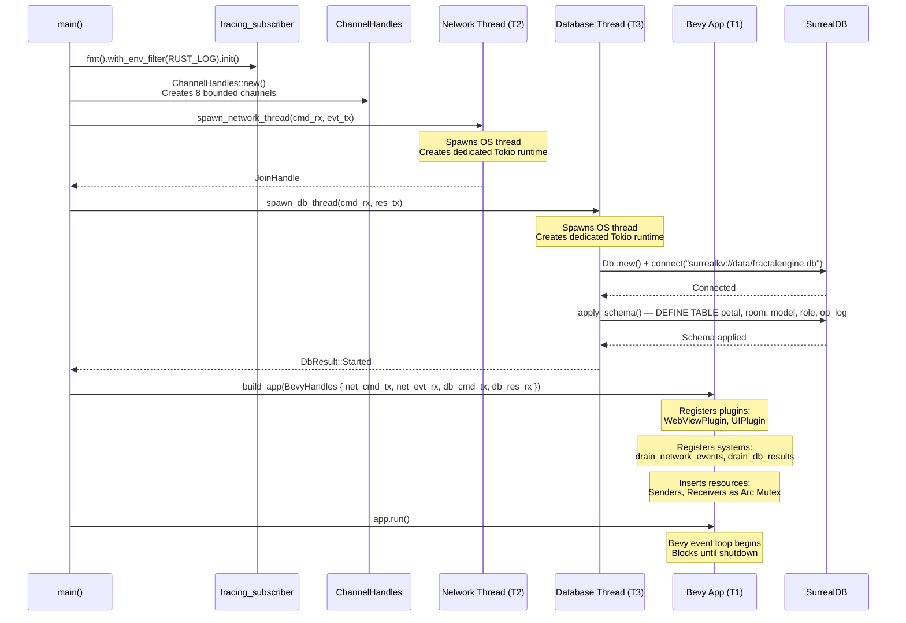

# Startup Sequence

The initialization order when `fractalengine` binary launches.

```mermaid
sequenceDiagram
    participant Main as main()
    participant Log as tracing_subscriber
    participant Ch as ChannelHandles
    participant T2 as Network Thread (T2)
    participant T3 as Database Thread (T3)
    participant App as Bevy App (T1)
    participant DB as SurrealDB

    Main->>Log: fmt().with_env_filter(RUST_LOG).init()
    Main->>Ch: ChannelHandles::new()<br/>Creates 8 bounded channels

    Main->>T2: spawn_network_thread(cmd_rx, evt_tx)
    Note over T2: Spawns OS thread<br/>Creates dedicated Tokio runtime
    T2-->>Main: JoinHandle

    Main->>T3: spawn_db_thread(cmd_rx, res_tx)
    Note over T3: Spawns OS thread<br/>Creates dedicated Tokio runtime
    T3->>DB: Db::new() + connect("surrealkv://data/fractalengine.db")
    DB-->>T3: Connected
    T3->>DB: apply_schema() — DEFINE TABLE petal, room, model, role, op_log
    DB-->>T3: Schema applied
    T3-->>Main: DbResult::Started

    Main->>App: build_app(BevyHandles { net_cmd_tx, net_evt_rx, db_cmd_tx, db_res_rx })
    Note over App: Registers plugins:<br/>WebViewPlugin, UIPlugin
    Note over App: Registers systems:<br/>drain_network_events, drain_db_results
    Note over App: Inserts resources:<br/>Senders, Receivers as Arc Mutex

    Main->>App: app.run()
    Note over App: Bevy event loop begins<br/>Blocks until shutdown
```
