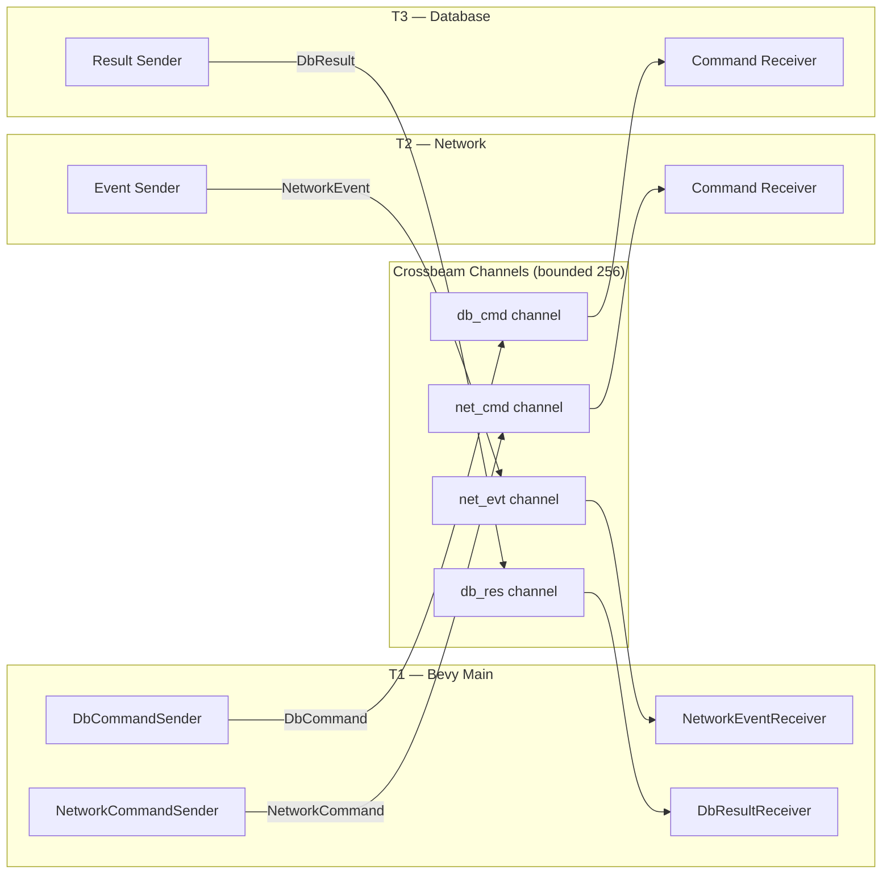
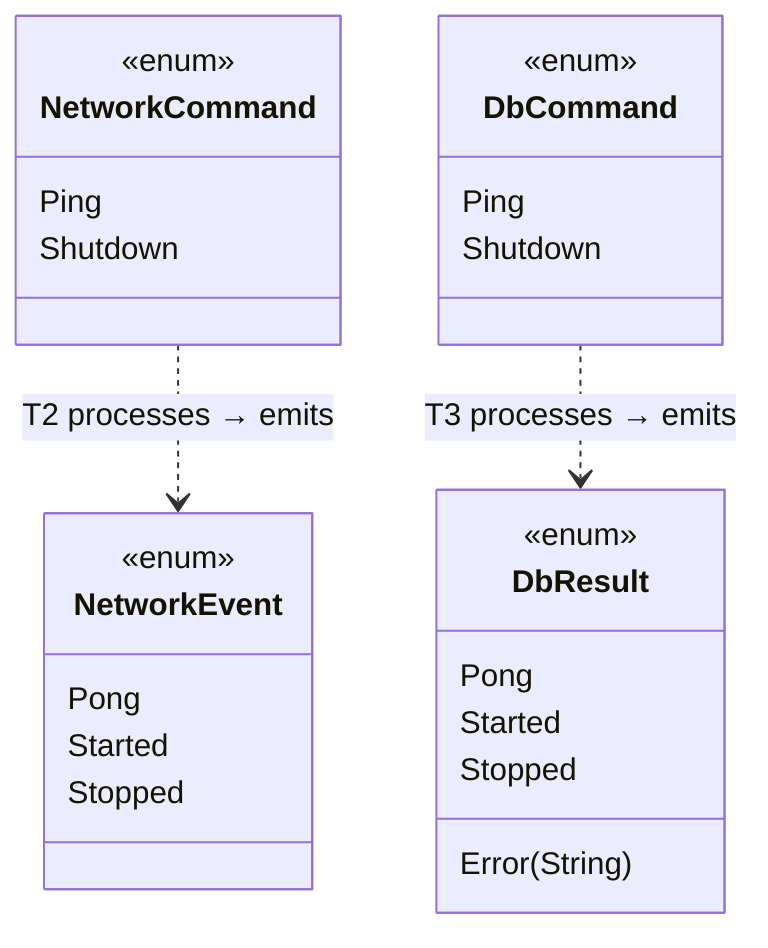

# Channel Bridge

All 8 typed crossbeam channels that connect the three threads. Every channel is bounded at 256 to provide backpressure.

```mermaid
graph LR
    subgraph T1["T1 — Bevy Main"]
        NetCmdTx[NetworkCommandSender]
        NetEvtRx[NetworkEventReceiver]
        DbCmdTx[DbCommandSender]
        DbResRx[DbResultReceiver]
    end

    subgraph Channels["Crossbeam Channels (bounded 256)"]
        C1["net_cmd channel"]
        C2["net_evt channel"]
        C3["db_cmd channel"]
        C4["db_res channel"]
    end

    subgraph T2["T2 — Network"]
        NetCmdRx[Command Receiver]
        NetEvtTx[Event Sender]
    end

    subgraph T3["T3 — Database"]
        DbCmdRx[Command Receiver]
        DbResTx[Result Sender]
    end

    NetCmdTx -->|NetworkCommand| C1 --> NetCmdRx
    NetEvtTx -->|NetworkEvent| C2 --> NetEvtRx
    DbCmdTx -->|DbCommand| C3 --> DbCmdRx
    DbResTx -->|DbResult| C4 --> DbResRx
```

## Message Types

```mermaid
classDiagram
    class NetworkCommand {
        <<enum>>
        Ping
        Shutdown
    }

    class NetworkEvent {
        <<enum>>
        Pong
        Started
        Stopped
    }

    class DbCommand {
        <<enum>>
        Ping
        Shutdown
    }

    class DbResult {
        <<enum>>
        Pong
        Started
        Stopped
        Error(String)
    }

    NetworkCommand ..> NetworkEvent : T2 processes → emits
    DbCommand ..> DbResult : T3 processes → emits
```
