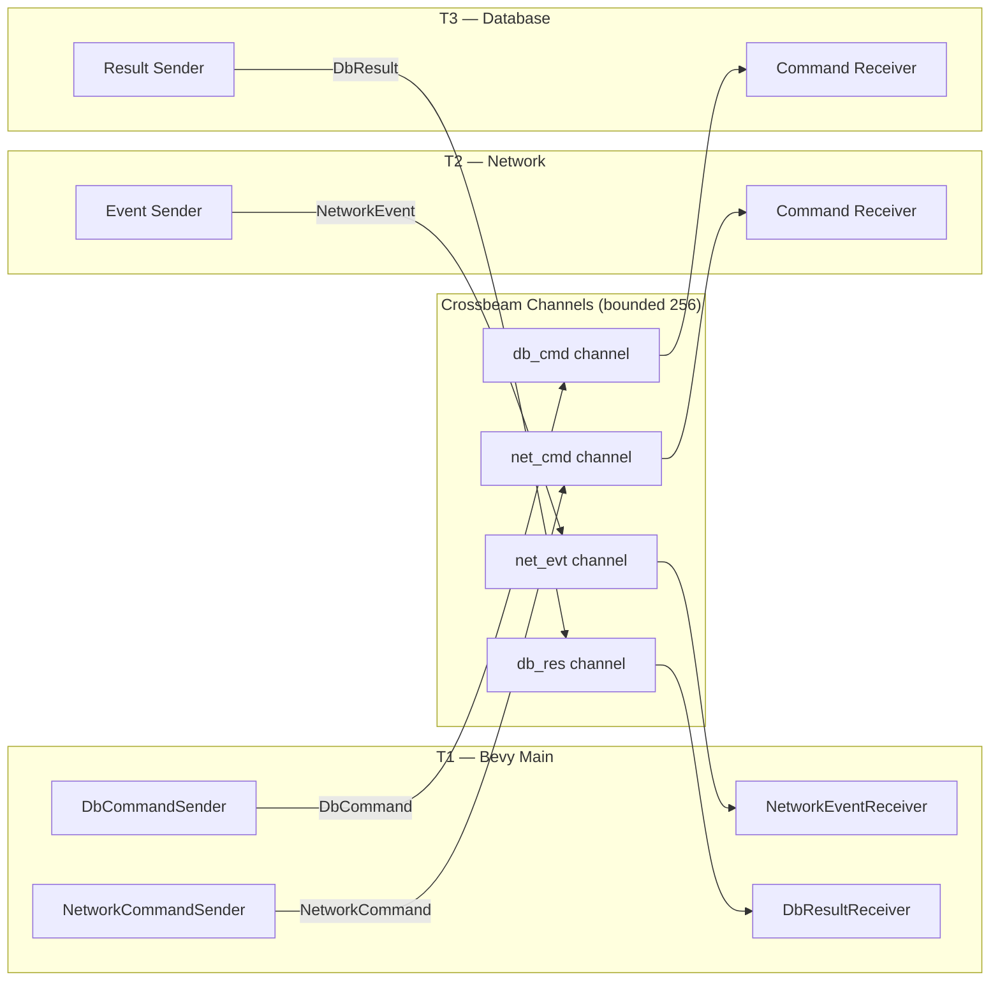
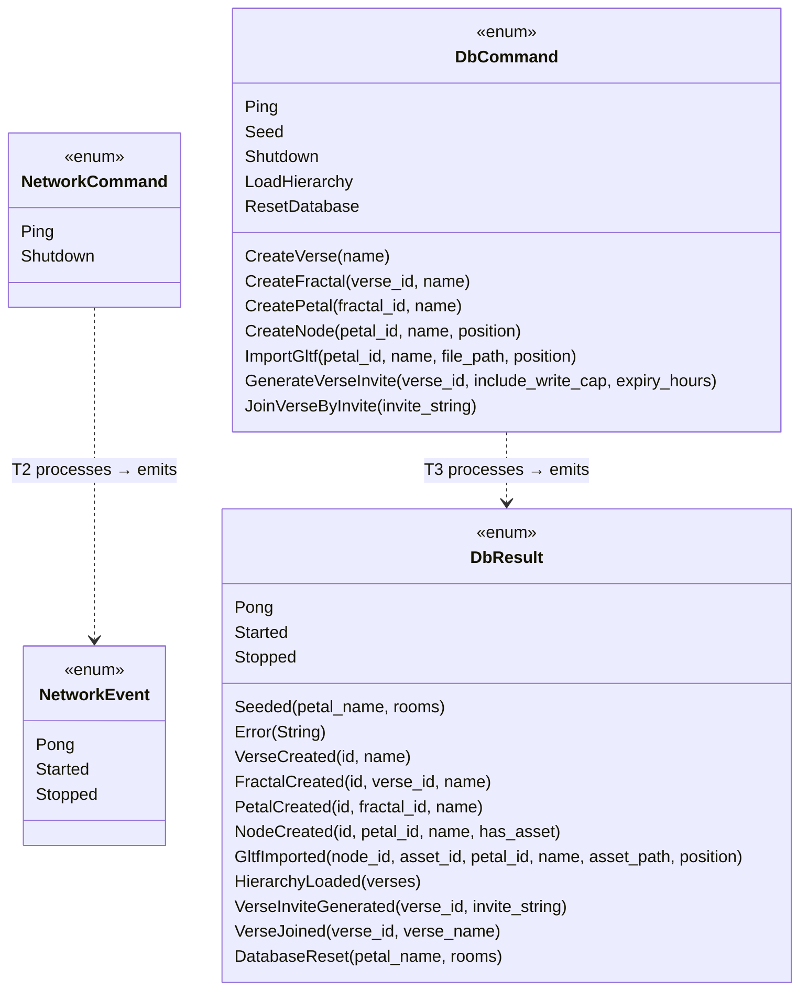

# Channel Bridge

All typed crossbeam channels that connect the three threads. Every channel is bounded at 256 to provide backpressure.



## Message Types



## Hierarchy Data Flow

The `LoadHierarchy` command returns the full tree as nested structs:

```
DbResult::HierarchyLoaded
  └── Vec<VerseHierarchyData>
        ├── id, name, namespace_id
        └── Vec<FractalHierarchyData>
              ├── id, name
              └── Vec<PetalHierarchyData>
                    ├── id, name
                    └── Vec<NodeHierarchyData>
                          ├── id, name, has_asset, position
                          ├── asset_path (optional)
                          └── petal_id
```
