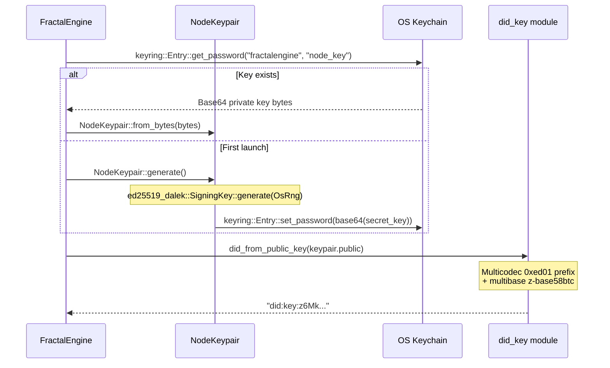
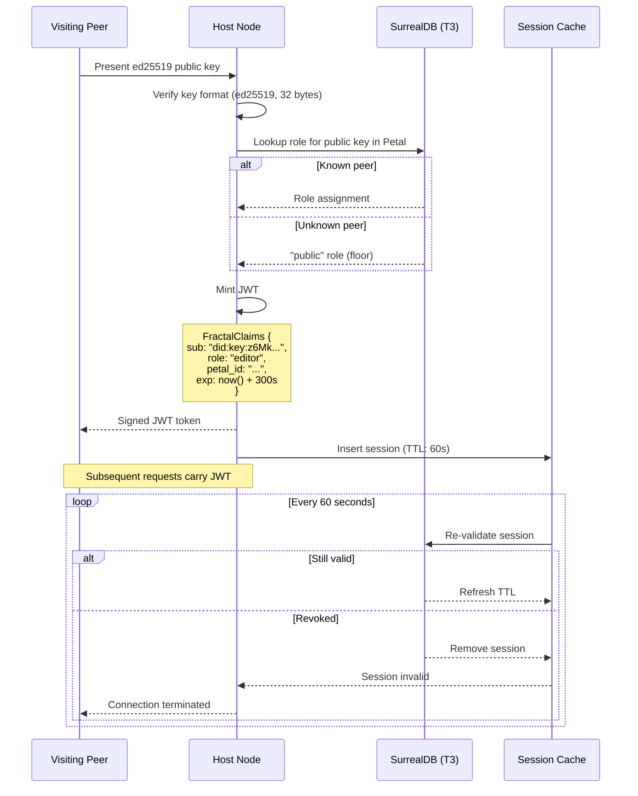
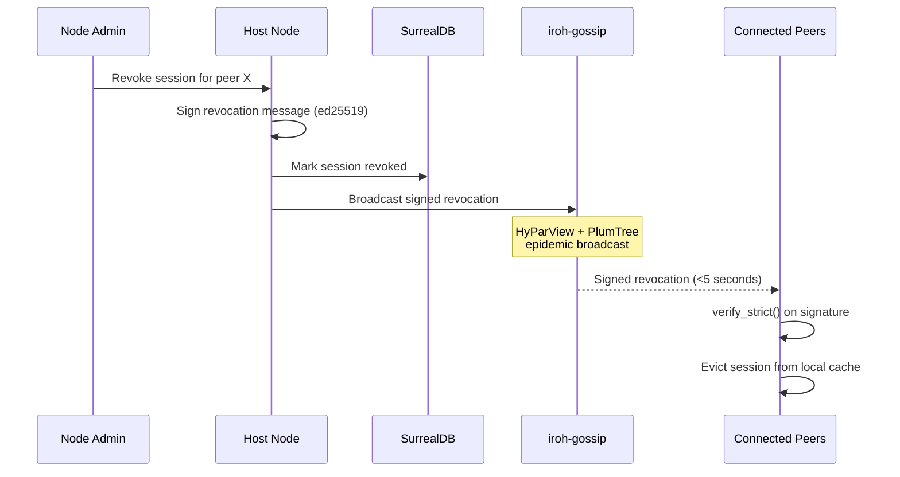

# Identity & Authentication Flow

## Key Generation (First Launch)

```mermaid
sequenceDiagram
    participant App as FractalEngine
    participant KP as NodeKeypair
    participant KC as OS Keychain
    participant DID as did_key module

    App->>KC: keyring::Entry::get_password("fractalengine", "node_key")
    alt Key exists
        KC-->>App: Base64 private key bytes
        App->>KP: NodeKeypair::from_bytes(bytes)
    else First launch
        App->>KP: NodeKeypair::generate()
        Note over KP: ed25519_dalek::SigningKey::generate(OsRng)
        KP->>KC: keyring::Entry::set_password(base64(secret_key))
    end

    App->>DID: did_from_public_key(keypair.public)
    Note over DID: Multicodec 0xed01 prefix<br/>+ multibase z-base58btc
    DID-->>App: "did:key:z6Mk..."
```

## Peer Authentication Handshake

```mermaid
sequenceDiagram
    participant Visitor as Visiting Peer
    participant Host as Host Node
    participant DB as SurrealDB (T3)
    participant Cache as Session Cache

    Visitor->>Host: Present ed25519 public key
    Host->>Host: Verify key format (ed25519, 32 bytes)

    Host->>DB: Lookup role for public key in Petal
    alt Known peer
        DB-->>Host: Role assignment
    else Unknown peer
        DB-->>Host: "public" role (floor)
    end

    Host->>Host: Mint JWT
    Note over Host: FractalClaims {<br/>  sub: "did:key:z6Mk...",<br/>  role: "editor",<br/>  petal_id: "...",<br/>  exp: now() + 300s<br/>}

    Host-->>Visitor: Signed JWT token
    Host->>Cache: Insert session (TTL: 60s)

    Note over Visitor,Host: Subsequent requests carry JWT

    loop Every 60 seconds
        Cache->>DB: Re-validate session
        alt Still valid
            DB-->>Cache: Refresh TTL
        else Revoked
            DB-->>Cache: Remove session
            Cache-->>Host: Session invalid
            Host-->>Visitor: Connection terminated
        end
    end
```

## Session Revocation

```mermaid
sequenceDiagram
    participant Admin as Node Admin
    participant Host as Host Node
    participant DB as SurrealDB
    participant Gossip as iroh-gossip
    participant Peers as Connected Peers

    Admin->>Host: Revoke session for peer X
    Host->>Host: Sign revocation message (ed25519)
    Host->>DB: Mark session revoked
    Host->>Gossip: Broadcast signed revocation

    Note over Gossip: HyParView + PlumTree<br/>epidemic broadcast

    Gossip-->>Peers: Signed revocation (<5 seconds)
    Peers->>Peers: verify_strict() on signature
    Peers->>Peers: Evict session from local cache
```
