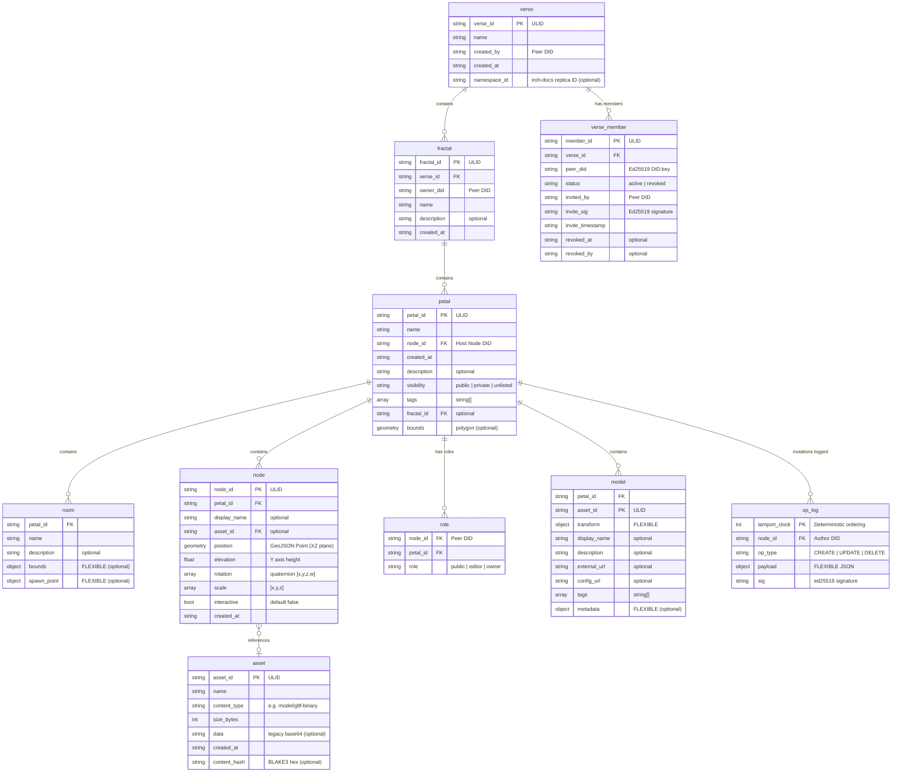
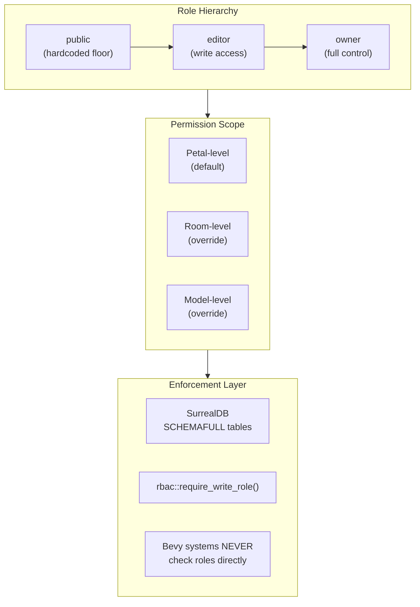
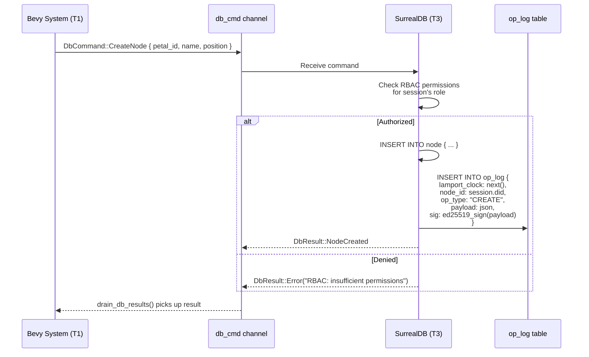
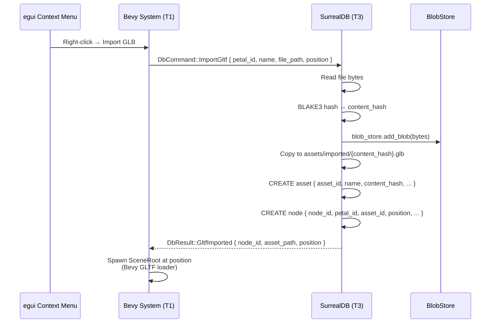

# Database Schema

SurrealDB tables and their relationships. All tables use `SCHEMAFULL` mode and are defined via the `define_table!` macro in `fe-database/src/schema.rs`.

## Entity Relationships



## Full Hierarchy

```
Verse                        top-level container (P2P namespace)
  ├── VerseMember            peer membership + invite records
  └── Fractal                groups petals under a verse
        └── Petal            a 3D world/space
              ├── Room       a zone within a petal
              ├── Model      a placed 3D object (legacy)
              ├── Node       an interactive object (with optional Asset)
              │     └── Asset   GLTF/GLB metadata + blob store reference
              ├── Role       RBAC assignment (node ↔ petal)
              └── OpLog      append-only mutation log
```

## RBAC Permission Model



## Op-Log Write Flow



## Asset Import Flow


