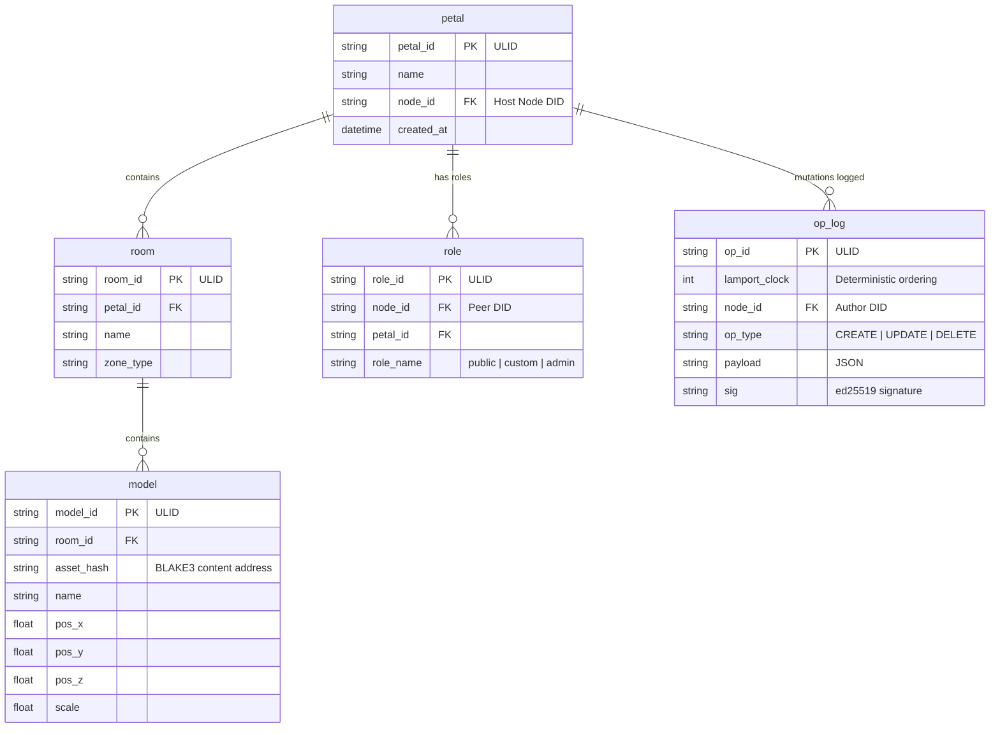
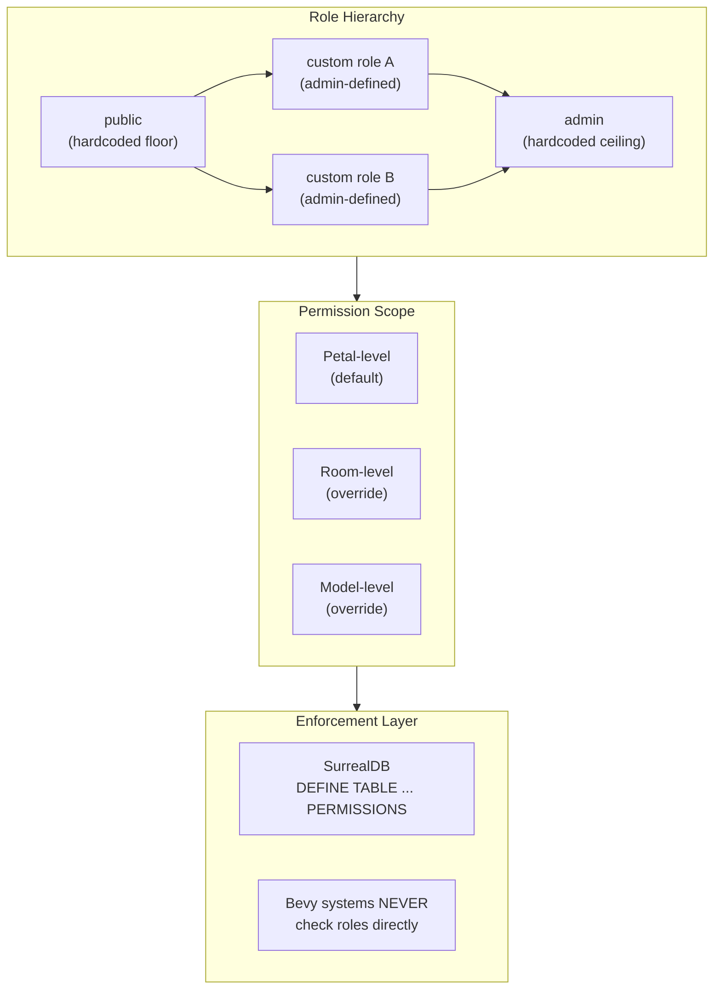
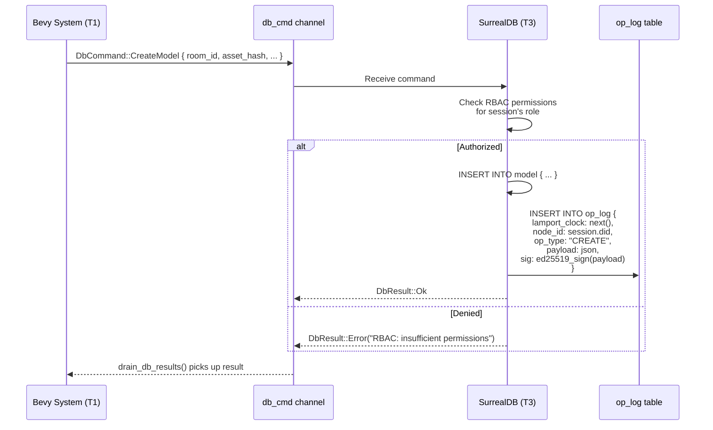

# Database Schema

SurrealDB tables and their relationships. All tables enforce RBAC via `PERMISSIONS` clauses.

## Entity Relationships

```mermaid
erDiagram
    petal ||--o{ room : contains
    room ||--o{ model : contains
    petal ||--o{ role : "has roles"
    petal ||--o{ op_log : "mutations logged"

    petal {
        string petal_id PK "ULID"
        string name
        string node_id FK "Host Node DID"
        datetime created_at
    }

    room {
        string room_id PK "ULID"
        string petal_id FK
        string name
        string zone_type
    }

    model {
        string model_id PK "ULID"
        string room_id FK
        string asset_hash "BLAKE3 content address"
        string name
        float pos_x
        float pos_y
        float pos_z
        float scale
    }

    role {
        string role_id PK "ULID"
        string node_id FK "Peer DID"
        string petal_id FK
        string role_name "public | custom | admin"
    }

    op_log {
        string op_id PK "ULID"
        int lamport_clock "Deterministic ordering"
        string node_id FK "Author DID"
        string op_type "CREATE | UPDATE | DELETE"
        string payload "JSON"
        string sig "ed25519 signature"
    }
```

## RBAC Permission Model

```mermaid
graph TD
    subgraph Roles["Role Hierarchy"]
        Public["public<br/>(hardcoded floor)"]
        Custom1["custom role A<br/>(admin-defined)"]
        Custom2["custom role B<br/>(admin-defined)"]
        Admin["admin<br/>(hardcoded ceiling)"]
    end

    Public --> Custom1 --> Admin
    Public --> Custom2 --> Admin

    subgraph Scope["Permission Scope"]
        Petal_Scope["Petal-level<br/>(default)"]
        Room_Scope["Room-level<br/>(override)"]
        Model_Scope["Model-level<br/>(override)"]
    end

    subgraph Enforcement["Enforcement Layer"]
        SDB["SurrealDB<br/>DEFINE TABLE ... PERMISSIONS"]
        Note["Bevy systems NEVER<br/>check roles directly"]
    end

    Roles --> Scope --> Enforcement
```

## Op-Log Write Flow

```mermaid
sequenceDiagram
    participant Sys as Bevy System (T1)
    participant Ch as db_cmd channel
    participant DB as SurrealDB (T3)
    participant Log as op_log table

    Sys->>Ch: DbCommand::CreateModel { room_id, asset_hash, ... }
    Ch->>DB: Receive command

    DB->>DB: Check RBAC permissions<br/>for session's role
    alt Authorized
        DB->>DB: INSERT INTO model { ... }
        DB->>Log: INSERT INTO op_log {<br/>  lamport_clock: next(),<br/>  node_id: session.did,<br/>  op_type: "CREATE",<br/>  payload: json,<br/>  sig: ed25519_sign(payload)<br/>}
        DB-->>Ch: DbResult::Ok
    else Denied
        DB-->>Ch: DbResult::Error("RBAC: insufficient permissions")
    end

    Ch-->>Sys: drain_db_results() picks up result
```
