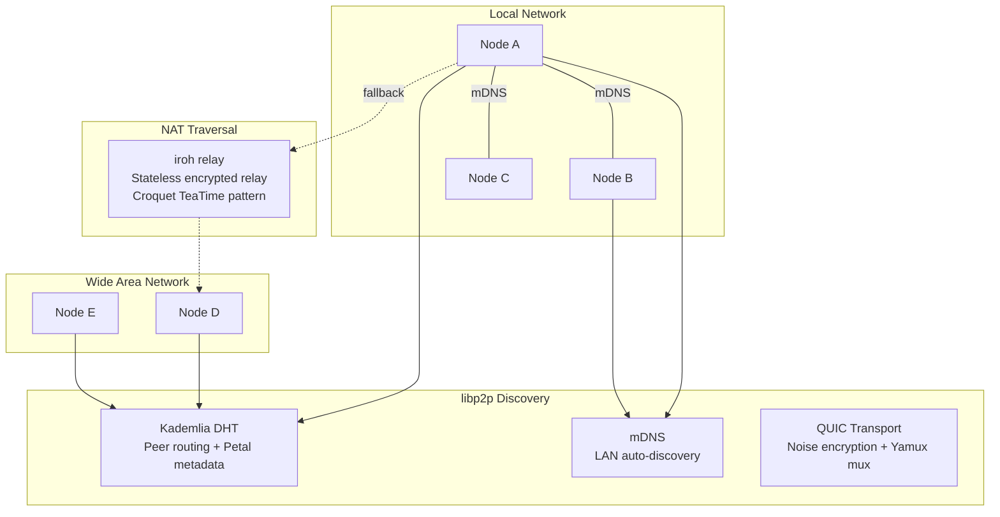
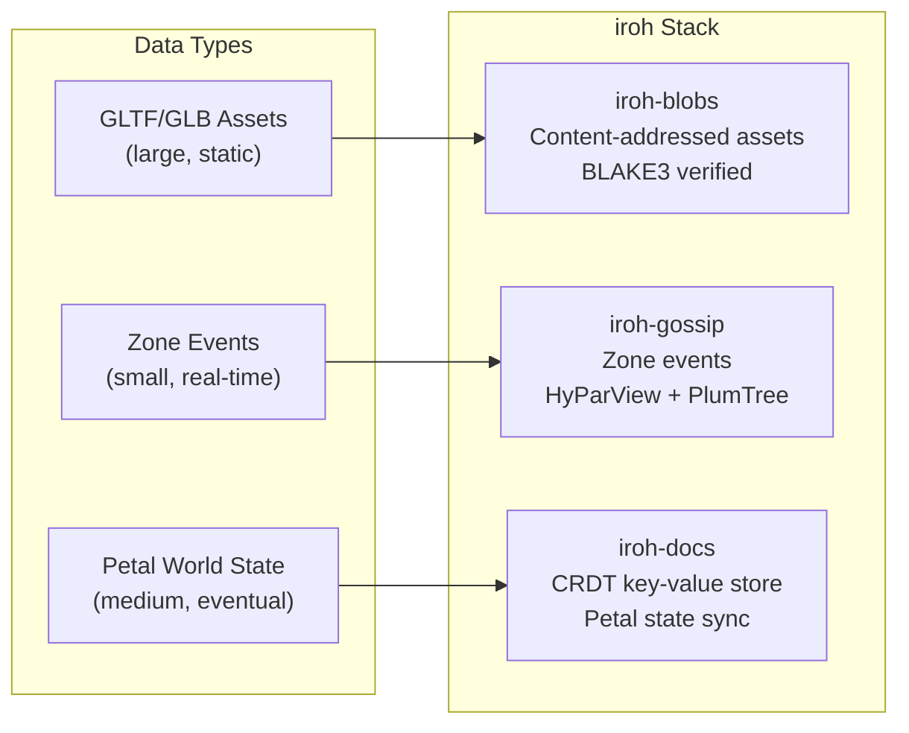
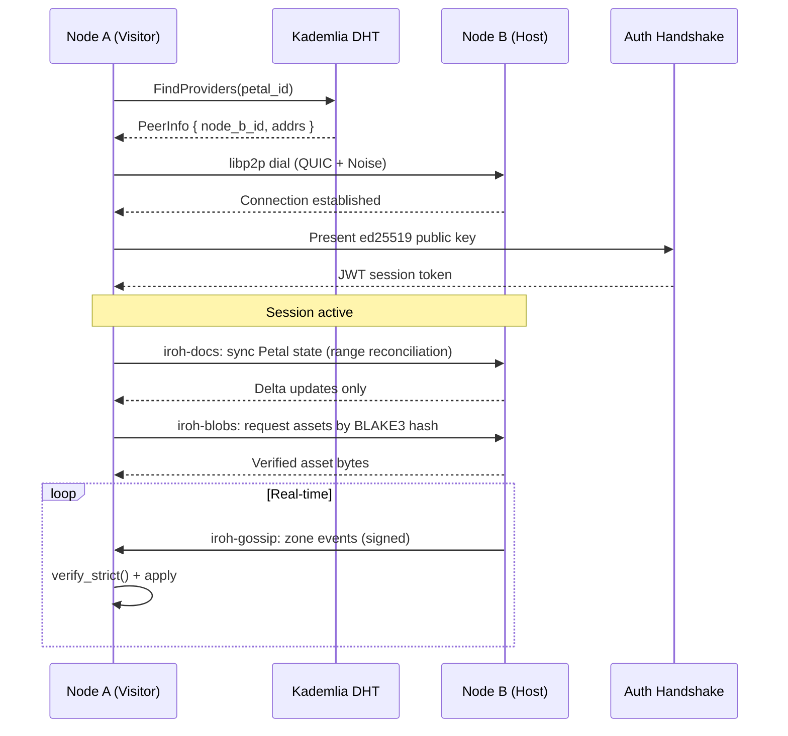

# Network Topology

## Peer Discovery

```mermaid
graph TB
    subgraph LAN["Local Network"]
        Node_A[Node A] ---|mDNS| Node_B[Node B]
        Node_A ---|mDNS| Node_C[Node C]
    end

    subgraph WAN["Wide Area Network"]
        Node_D[Node D]
        Node_E[Node E]
    end

    subgraph Discovery["libp2p Discovery"]
        DHT[Kademlia DHT<br/>Peer routing + Petal metadata]
        MDNS[mDNS<br/>LAN auto-discovery]
        QUIC[QUIC Transport<br/>Noise encryption + Yamux mux]
    end

    Node_A --> DHT
    Node_D --> DHT
    Node_E --> DHT

    Node_A --> MDNS
    Node_B --> MDNS

    subgraph Relay["NAT Traversal"]
        IrohRelay[iroh relay<br/>Stateless encrypted relay<br/>Croquet TeaTime pattern]
    end

    Node_A -.->|fallback| IrohRelay -.-> Node_D
```

## Data Distribution Layers

```mermaid
graph LR
    subgraph "iroh Stack"
        direction TB
        Blobs["iroh-blobs<br/>Content-addressed assets<br/>BLAKE3 verified"]
        Gossip_["iroh-gossip<br/>Zone events<br/>HyParView + PlumTree"]
        Docs_["iroh-docs<br/>CRDT key-value store<br/>Petal state sync"]
    end

    subgraph "Data Types"
        direction TB
        Assets["GLTF/GLB Assets<br/>(large, static)"]
        Events["Zone Events<br/>(small, real-time)"]
        State["Petal World State<br/>(medium, eventual)"]
    end

    Assets --> Blobs
    Events --> Gossip_
    State --> Docs_
```

## Peer Connection Lifecycle

```mermaid
sequenceDiagram
    participant A as Node A (Visitor)
    participant DHT as Kademlia DHT
    participant B as Node B (Host)
    participant Auth as Auth Handshake

    A->>DHT: FindProviders(petal_id)
    DHT-->>A: PeerInfo { node_b_id, addrs }

    A->>B: libp2p dial (QUIC + Noise)
    B-->>A: Connection established

    A->>Auth: Present ed25519 public key
    Auth-->>A: JWT session token

    Note over A,B: Session active

    A->>B: iroh-docs: sync Petal state (range reconciliation)
    B-->>A: Delta updates only

    A->>B: iroh-blobs: request assets by BLAKE3 hash
    B-->>A: Verified asset bytes

    loop Real-time
        B->>A: iroh-gossip: zone events (signed)
        A->>A: verify_strict() + apply
    end
```
