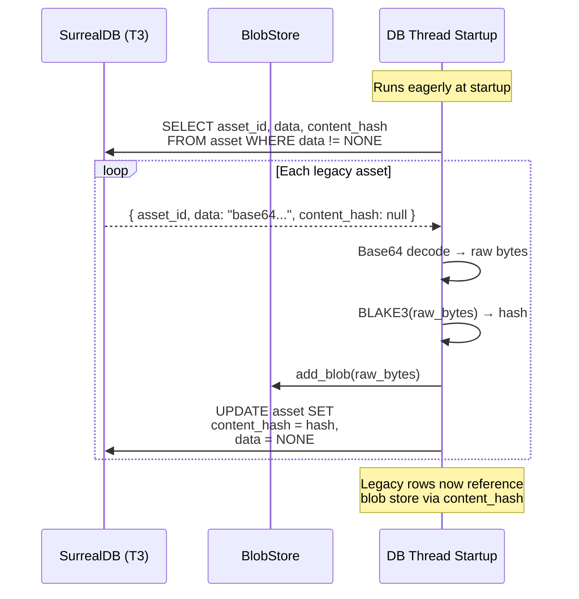
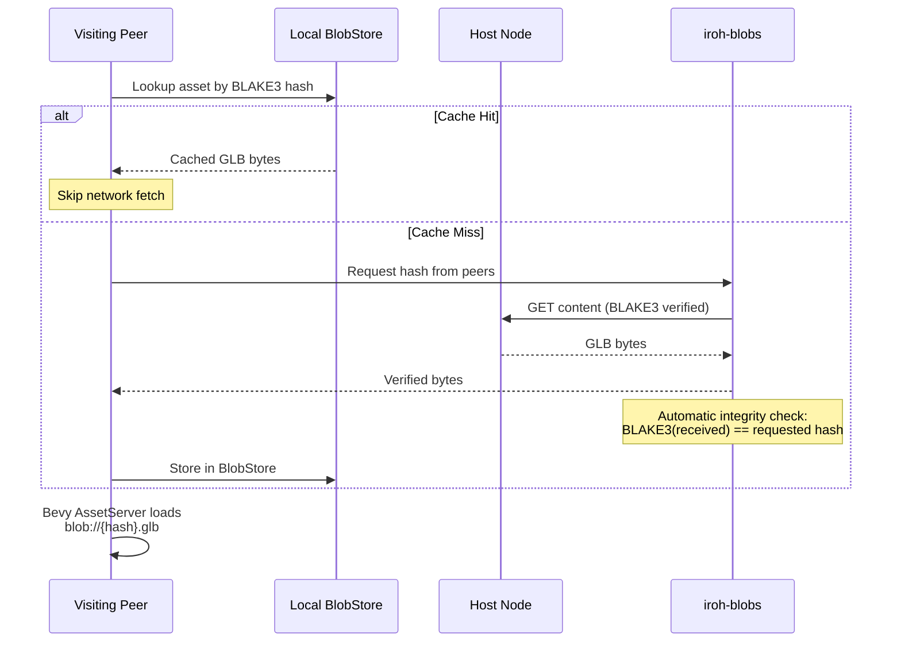
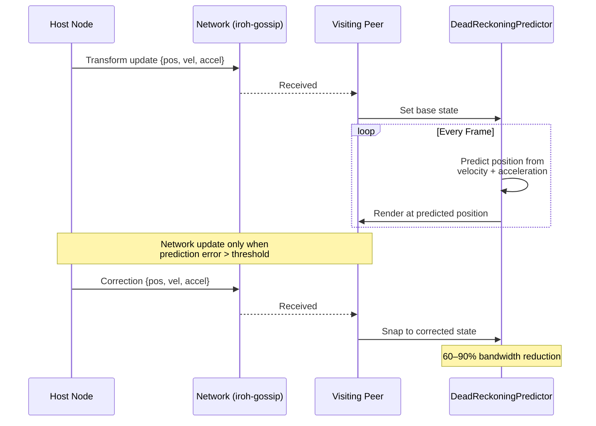

# Asset Pipeline

## GLTF Import Flow

```mermaid
graph TD
    Import[Right-click → Import GLB] --> FileDialog{File Dialog<br/>Select .glb/.gltf}
    FileDialog -->|Selected| Read[Read file bytes]
    Read --> Hash[BLAKE3 Hash<br/>Content Address]

    Hash --> BlobStore[BlobStore::add_blob<br/>Content-addressed storage]
    Hash --> Copy[Copy to<br/>assets/imported/{hash}.glb]

    BlobStore --> AssetRow[CREATE asset {<br/>  asset_id, name,<br/>  content_type, size_bytes,<br/>  content_hash<br/>}]
    Copy --> NodeRow[CREATE node {<br/>  node_id, petal_id,<br/>  asset_id, position,<br/>  elevation<br/>}]
    AssetRow --> NodeRow

    NodeRow --> Result[DbResult::GltfImported]
    Result --> Spawn[Bevy: Spawn SceneRoot<br/>at click position]
    Result --> Sidebar[Update sidebar<br/>hierarchy tree]

    subgraph "Content Addressing"
        Hash2[BLAKE3 bytes → hex string]
        Path["Asset path: blob://{hash}.glb<br/>or assets/imported/{hash}.glb"]
    end

    Hash --> Hash2 --> Path
```

## Legacy Base64 Migration (Phase C)



## Asset Distribution (Peer-to-Peer)



## Dead-Reckoning (Bandwidth Reduction)


