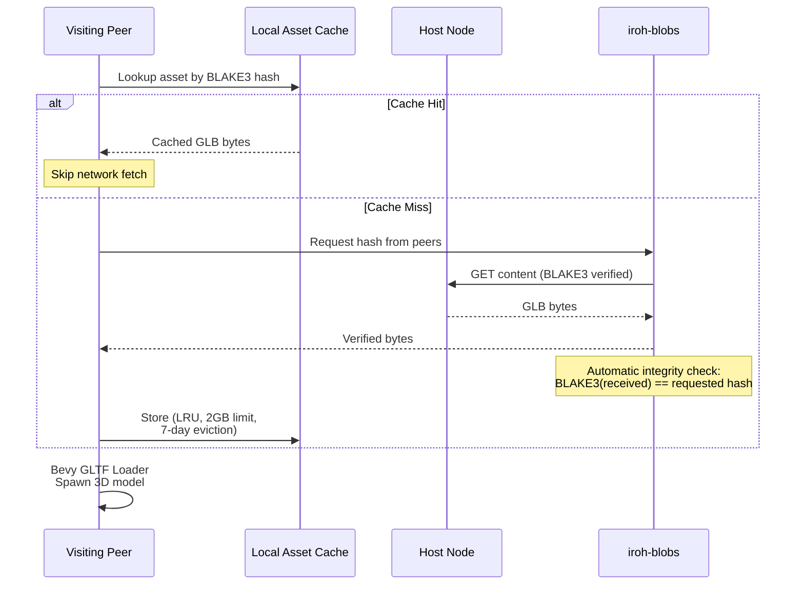
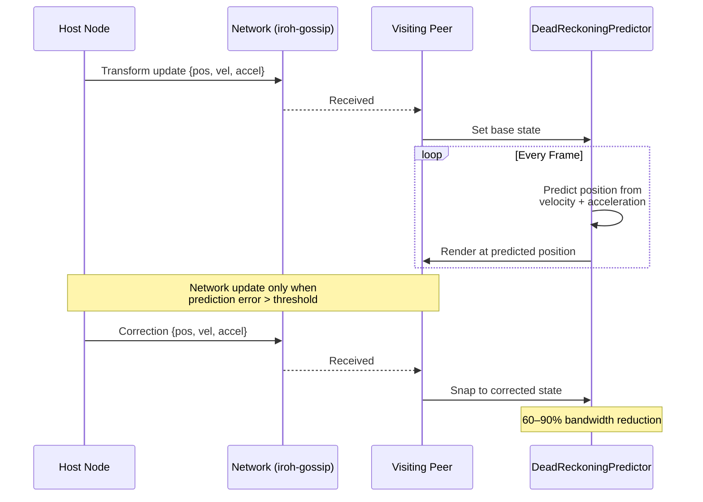

# Asset Pipeline

## GLTF Ingestion Flow

```mermaid
graph TD
    Upload[Operator Uploads<br/>GLB File] --> Validate{Valid GLTF/GLB?}
    Validate -->|No| Reject[Reject Upload<br/>GLTF/GLB only]
    Validate -->|Yes| Size{Size ≤ 256 MB?}
    Size -->|No| Reject2[Reject Upload<br/>Exceeds limit]
    Size -->|Yes| Hash[BLAKE3 Hash<br/>Content Address]

    Hash --> Ingest[AssetIngester::ingest]
    Ingest --> Store[Store in local<br/>asset cache]
    Store --> DB[Record in SurrealDB<br/>model table]
    DB --> Publish[Publish hash via<br/>iroh-blobs]

    subgraph "Content Addressing"
        Hash2[BLAKE3(glb_bytes)]
        ID["Asset ID = hash<br/>e.g. bafk...abc123"]
    end

    Hash --> Hash2 --> ID
```

## Asset Distribution (Peer-to-Peer)



## Dead-Reckoning (Bandwidth Reduction)


