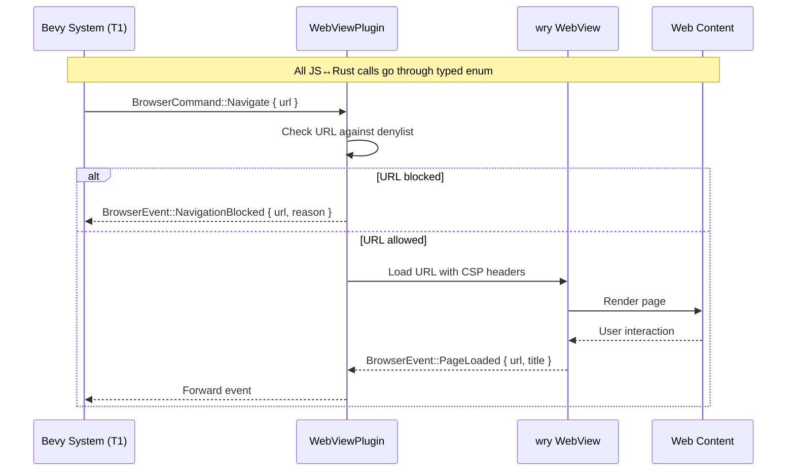
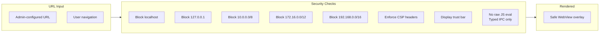

# WebView Architecture

## Browser Overlay System

```mermaid
graph TD
    subgraph T1["T1 — Bevy Main Thread"]
        Camera[Camera System]
        Plugin[WebViewPlugin]
        IPC[Typed IPC<br/>BrowserCommand / BrowserEvent]
    end

    subgraph Wry["wry WebView"]
        Overlay[Overlay Window<br/>Positioned per-frame]
        TrustBar["Trust Bar<br/>(non-dismissible)"]
        CSP[Content Security Policy<br/>Headers enforced]
        Denylist[URL Denylist<br/>localhost, 127.0.0.1, RFC 1918]
    end

    subgraph Model["3D Model Interaction"]
        Click[User clicks Model]
        Tabs[BrowserInteraction Tabs]
        Tab1["Tab 1: External URL<br/>(admin-configured)"]
        Tab2["Tab 2: Config Panel<br/>(role-gated settings)"]
    end

    Click --> Plugin
    Plugin --> Overlay
    Camera -->|world_to_viewport()| Overlay
    Overlay --> TrustBar
    Overlay --> Tabs
    Tabs --> Tab1 & Tab2

    IPC -->|BrowserCommand| Overlay
    Overlay -->|BrowserEvent| IPC
```

## IPC Command Flow



## Security Layers


