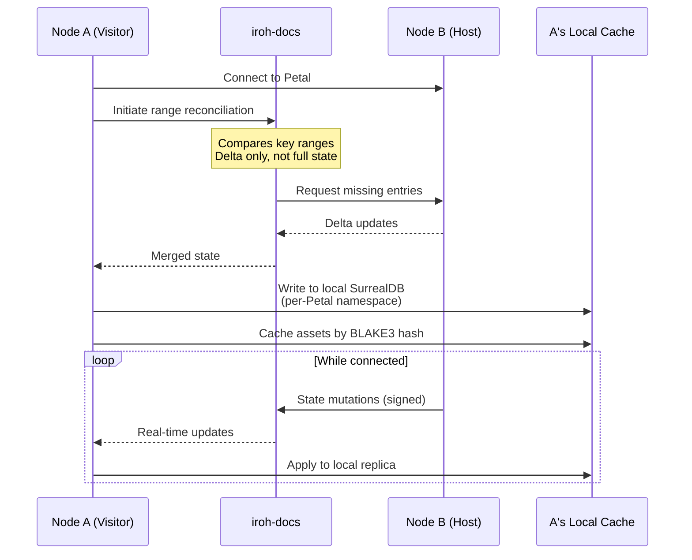
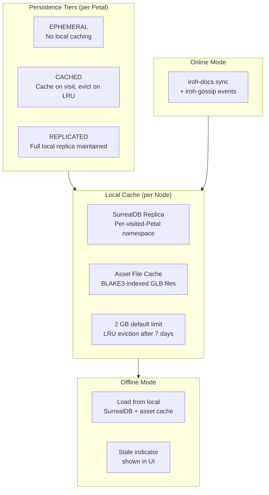
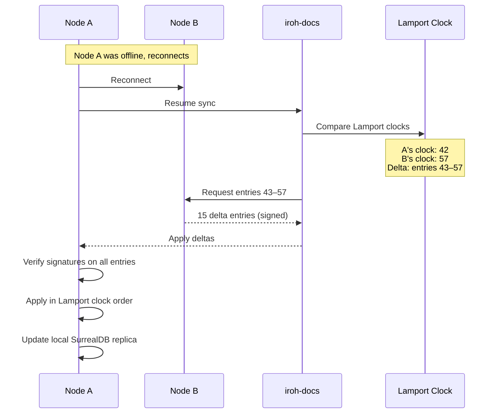

# Sync & Caching

## Petal Replication Flow

```mermaid
sequenceDiagram
    participant A as Node A (Visitor)
    participant Docs as iroh-docs
    participant B as Node B (Host)
    participant Cache as A's Local Cache

    A->>B: Connect to Petal
    A->>Docs: Initiate range reconciliation
    Note over Docs: Compares key ranges<br/>Delta only, not full state

    Docs->>B: Request missing entries
    B-->>Docs: Delta updates
    Docs-->>A: Merged state

    A->>Cache: Write to local SurrealDB<br/>(per-Petal namespace)
    A->>Cache: Cache assets by BLAKE3 hash

    loop While connected
        B->>Docs: State mutations (signed)
        Docs-->>A: Real-time updates
        A->>Cache: Apply to local replica
    end
```

## Caching Architecture

```mermaid
graph TD
    subgraph Cache["Local Cache (per Node)"]
        DB_Cache["SurrealDB Replica<br/>Per-visited-Petal namespace"]
        Asset_Cache["Asset File Cache<br/>BLAKE3-indexed GLB files"]
        Limit["2 GB default limit<br/>LRU eviction after 7 days"]
    end

    subgraph Tiers["Persistence Tiers (per Petal)"]
        Ephemeral["EPHEMERAL<br/>No local caching"]
        Cached["CACHED<br/>Cache on visit, evict on LRU"]
        Replicated["REPLICATED<br/>Full local replica maintained"]
    end

    subgraph Online["Online Mode"]
        Sync[iroh-docs sync<br/>+ iroh-gossip events]
    end

    subgraph Offline["Offline Mode"]
        Local[Load from local<br/>SurrealDB + asset cache]
        Stale["Stale indicator<br/>shown in UI"]
    end

    Tiers --> Cache
    Online --> Cache
    Cache --> Offline
```

## Reconnection Reconciliation

```mermaid
sequenceDiagram
    participant A as Node A
    participant B as Node B
    participant Docs as iroh-docs
    participant Clock as Lamport Clock

    Note over A,B: Node A was offline, reconnects

    A->>B: Reconnect
    A->>Docs: Resume sync

    Docs->>Clock: Compare Lamport clocks
    Note over Clock: A's clock: 42<br/>B's clock: 57<br/>Delta: entries 43–57

    Docs->>B: Request entries 43–57
    B-->>Docs: 15 delta entries (signed)
    Docs-->>A: Apply deltas

    A->>A: Verify signatures on all entries
    A->>A: Apply in Lamport clock order
    A->>A: Update local SurrealDB replica
```
