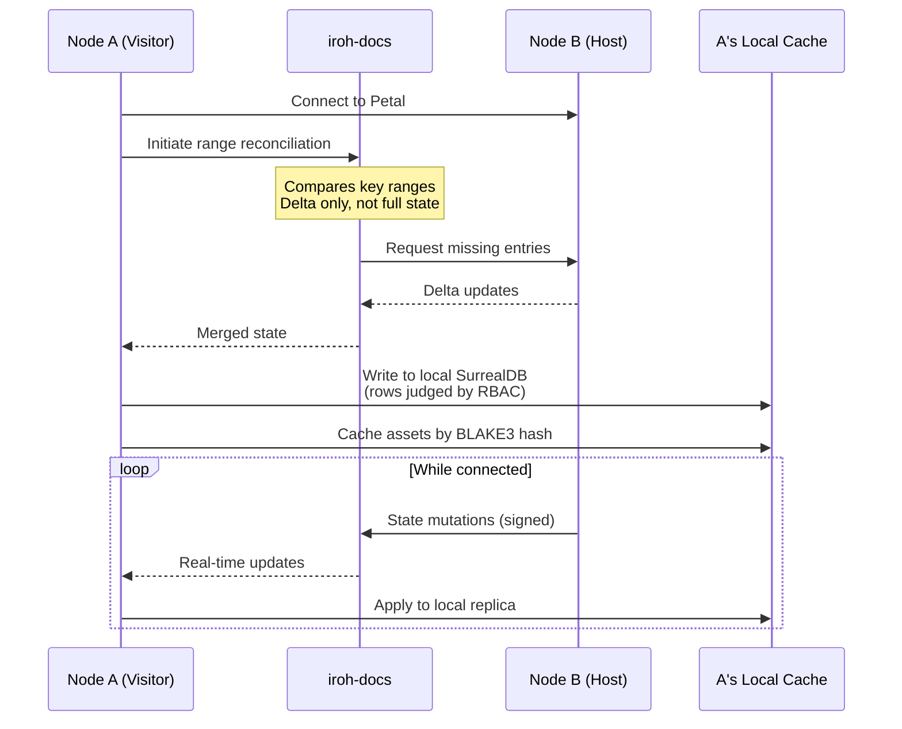
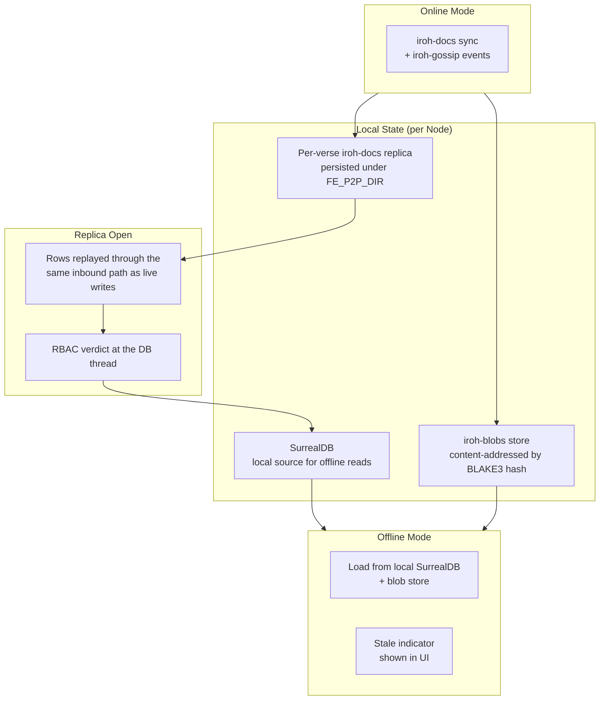
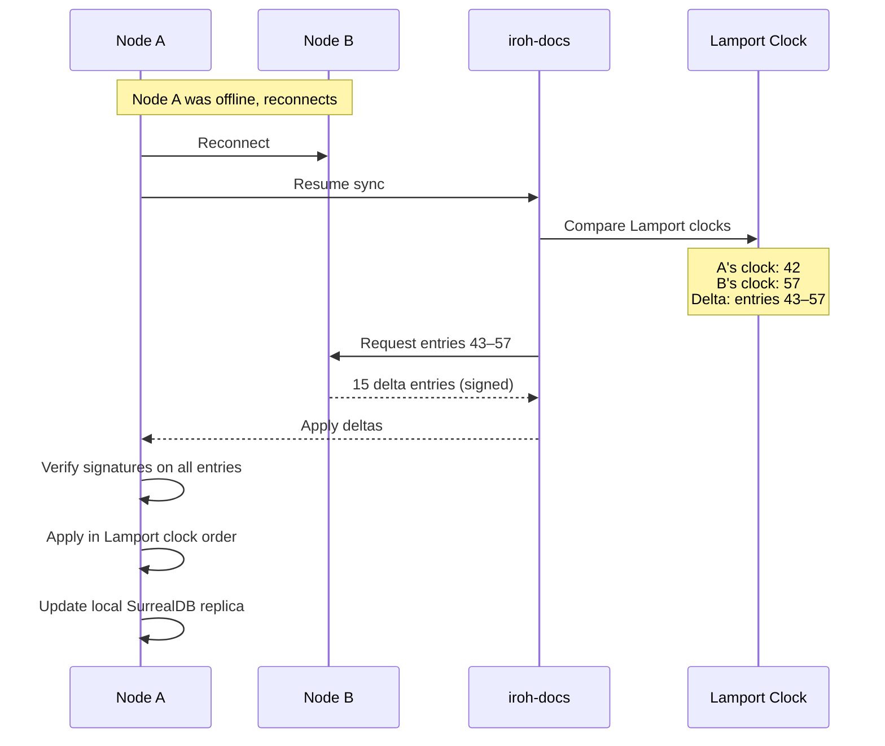

# Sync & Caching

## Petal Replication Flow

```mermaid
sequenceDiagram
    participant A as Node A (Visitor)
    participant Docs as iroh-docs
    participant B as Node B (Host)
    participant Cache as A's Local Cache

    A->>B: Connect to Petal
    A->>Docs: Initiate range reconciliation
    Note over Docs: Compares key ranges<br/>Delta only, not full state

    Docs->>B: Request missing entries
    B-->>Docs: Delta updates
    Docs-->>A: Merged state

    A->>Cache: Write to local SurrealDB<br/>(rows judged by RBAC)
    A->>Cache: Cache assets by BLAKE3 hash

    loop While connected
        B->>Docs: State mutations (signed)
        Docs-->>A: Real-time updates
        A->>Cache: Apply to local replica
    end
```

## Caching Architecture

There is no size cap or eviction policy on the verse replica or the blob store.

```mermaid
graph TD
    subgraph Local["Local State (per Node)"]
        Replica["Per-verse iroh-docs replica<br/>persisted under FE_P2P_DIR"]
        BlobStore["iroh-blobs store<br/>content-addressed by BLAKE3 hash"]
        DB_Cache["SurrealDB<br/>local source for offline reads"]
    end

    subgraph Online["Online Mode"]
        Sync["iroh-docs sync<br/>+ iroh-gossip events"]
    end

    subgraph Open["Replica Open"]
        Replay["Rows replayed through the<br/>same inbound path as live writes"]
        Judge["RBAC verdict at the DB thread"]
    end

    subgraph Offline["Offline Mode"]
        LocalRead["Load from local SurrealDB<br/>+ blob store"]
        Stale["Stale indicator<br/>shown in UI"]
    end

    Online --> Replica
    Replica --> Replay
    Replay --> Judge
    Judge --> DB_Cache
    Online --> BlobStore
    DB_Cache --> Offline
    BlobStore --> Offline
```

## Reconnection Reconciliation

```mermaid
sequenceDiagram
    participant A as Node A
    participant B as Node B
    participant Docs as iroh-docs
    participant Clock as Lamport Clock

    Note over A,B: Node A was offline, reconnects

    A->>B: Reconnect
    A->>Docs: Resume sync

    Docs->>Clock: Compare Lamport clocks
    Note over Clock: A's clock: 42<br/>B's clock: 57<br/>Delta: entries 43–57

    Docs->>B: Request entries 43–57
    B-->>Docs: 15 delta entries (signed)
    Docs-->>A: Apply deltas

    A->>A: Verify signatures on all entries
    A->>A: Apply in Lamport clock order
    A->>A: Update local SurrealDB replica
```
