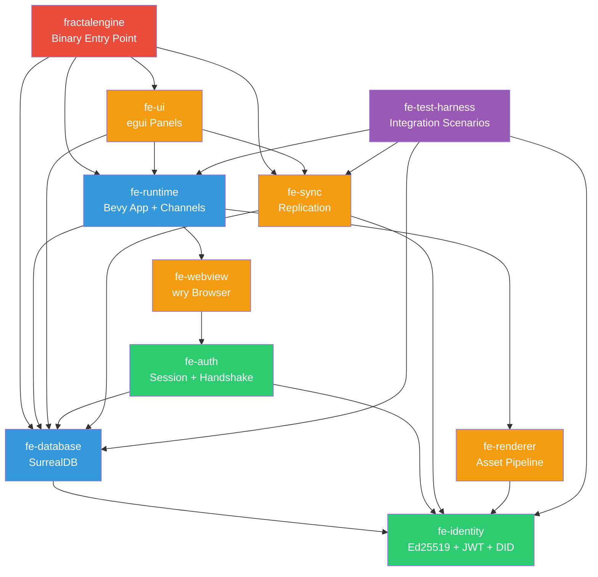
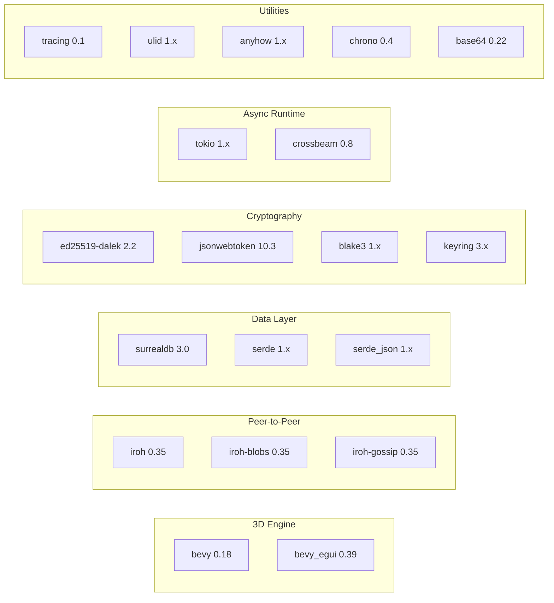

# Crate Dependency Graph

Internal workspace crate dependencies.

```mermaid
graph TD
    FE[fractalengine<br/>Binary Entry Point]

    FE --> Runtime[fe-runtime<br/>Bevy App + Channels]
    FE --> Database[fe-database<br/>SurrealDB]
    FE --> Sync[fe-sync<br/>Replication]
    FE --> UIPlugin[fe-ui<br/>egui Panels]

    Runtime --> Database
    Runtime --> Renderer[fe-renderer<br/>Asset Pipeline]
    Runtime --> WebView[fe-webview<br/>wry Browser]

    UIPlugin --> Runtime
    UIPlugin --> Database
    UIPlugin --> Sync

    Database --> Identity[fe-identity<br/>Ed25519 + JWT + DID]
    Auth[fe-auth<br/>Session + Handshake] --> Identity
    Auth --> Database

    Sync --> Database
    Sync --> Identity

    Renderer --> Identity
    WebView --> Auth

    TestHarness[fe-test-harness<br/>Integration Scenarios] --> Database
    TestHarness --> Runtime
    TestHarness --> Identity
    TestHarness --> Sync

    classDef binary fill:#e74c3c,color:#fff
    classDef core fill:#3498db,color:#fff
    classDef infra fill:#2ecc71,color:#fff
    classDef feature fill:#f39c12,color:#fff
    classDef test fill:#9b59b6,color:#fff

    class FE binary
    class Runtime,Database core
    class Identity,Auth infra
    class Renderer,WebView,UIPlugin,Sync feature
    class TestHarness test
```

## External Dependency Map

```mermaid
graph LR
    subgraph Engine["3D Engine"]
        Bevy[bevy 0.18]
        Egui[bevy_egui 0.39]
    end

    subgraph P2P["Peer-to-Peer"]
        Iroh[iroh 0.35]
        IrohB[iroh-blobs 0.35]
        IrohG[iroh-gossip 0.35]
    end

    subgraph Data["Data Layer"]
        Surreal[surrealdb 3.0]
        Serde[serde 1.x]
        SerdeJ[serde_json 1.x]
    end

    subgraph Crypto["Cryptography"]
        Ed25519[ed25519-dalek 2.2]
        JWT[jsonwebtoken 10.3]
        Blake[blake3 1.x]
        Keyring_[keyring 3.x]
    end

    subgraph Async["Async Runtime"]
        Tokio_[tokio 1.x]
        Crossbeam_[crossbeam 0.8]
    end

    subgraph Util["Utilities"]
        Tracing_[tracing 0.1]
        ULID[ulid 1.x]
        Anyhow[anyhow 1.x]
        Chrono[chrono 0.4]
        Base64[base64 0.22]
    end
```
