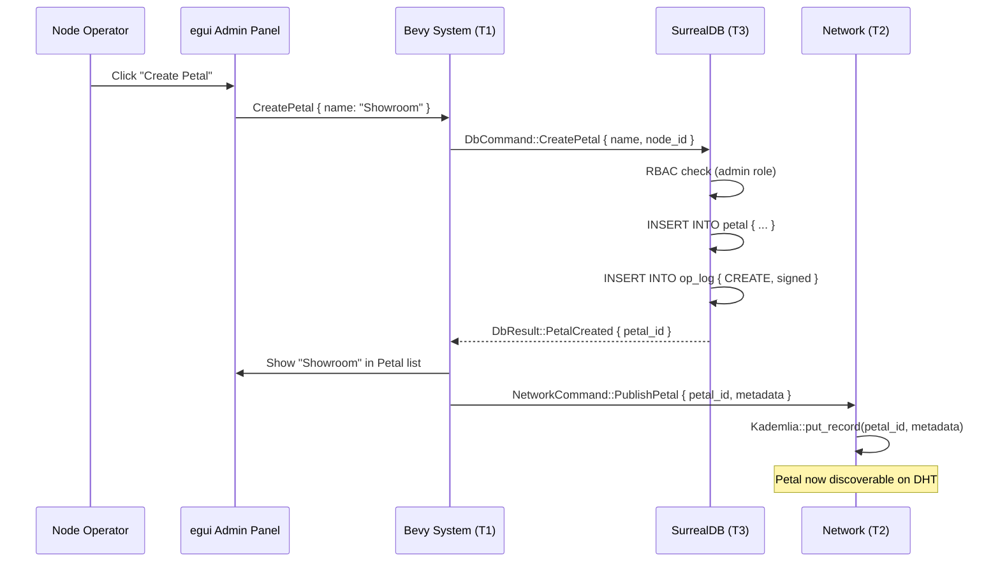
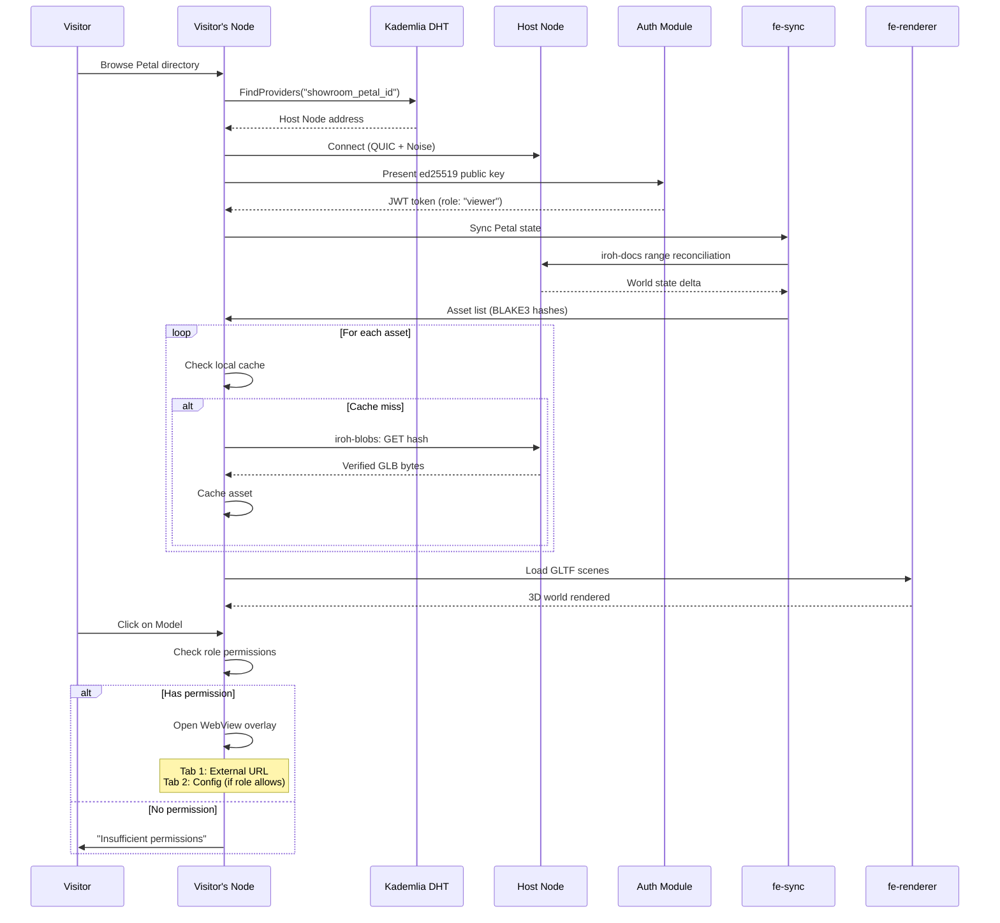
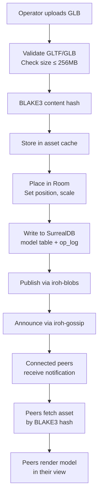

# User Interaction Flow

## End-to-End: Operator Creates a Petal

```mermaid
sequenceDiagram
    participant Op as Node Operator
    participant UI as egui Admin Panel
    participant T1 as Bevy System (T1)
    participant T3 as SurrealDB (T3)
    participant T2 as Network (T2)

    Op->>UI: Click "Create Petal"
    UI->>T1: CreatePetal { name: "Showroom" }
    T1->>T3: DbCommand::CreatePetal { name, node_id }

    T3->>T3: RBAC check (admin role)
    T3->>T3: INSERT INTO petal { ... }
    T3->>T3: INSERT INTO op_log { CREATE, signed }
    T3-->>T1: DbResult::PetalCreated { petal_id }

    T1->>UI: Show "Showroom" in Petal list

    T1->>T2: NetworkCommand::PublishPetal { petal_id, metadata }
    T2->>T2: Kademlia::put_record(petal_id, metadata)
    Note over T2: Petal now discoverable on DHT
```

## End-to-End: Visitor Enters a Petal

```mermaid
sequenceDiagram
    participant V as Visitor
    participant VApp as Visitor's Node
    participant DHT as Kademlia DHT
    participant Host as Host Node
    participant Auth as Auth Module
    participant Sync as fe-sync
    participant Render as fe-renderer

    V->>VApp: Browse Petal directory
    VApp->>DHT: FindProviders("showroom_petal_id")
    DHT-->>VApp: Host Node address

    VApp->>Host: Connect (QUIC + Noise)
    VApp->>Auth: Present ed25519 public key
    Auth-->>VApp: JWT token (role: "viewer")

    VApp->>Sync: Sync Petal state
    Sync->>Host: iroh-docs range reconciliation
    Host-->>Sync: World state delta

    Sync->>VApp: Asset list (BLAKE3 hashes)

    loop For each asset
        VApp->>VApp: Check local cache
        alt Cache miss
            VApp->>Host: iroh-blobs: GET hash
            Host-->>VApp: Verified GLB bytes
            VApp->>VApp: Cache asset
        end
    end

    VApp->>Render: Load GLTF scenes
    Render-->>VApp: 3D world rendered

    V->>VApp: Click on Model
    VApp->>VApp: Check role permissions
    alt Has permission
        VApp->>VApp: Open WebView overlay
        Note over VApp: Tab 1: External URL<br/>Tab 2: Config (if role allows)
    else No permission
        VApp->>V: "Insufficient permissions"
    end
```

## End-to-End: Model Placement

```mermaid
graph TD
    Upload[Operator uploads GLB] --> Validate[Validate GLTF/GLB<br/>Check size ≤ 256MB]
    Validate --> Hash[BLAKE3 content hash]
    Hash --> Store[Store in asset cache]
    Store --> Place[Place in Room<br/>Set position, scale]

    Place --> DB[Write to SurrealDB<br/>model table + op_log]
    DB --> Publish[Publish via iroh-blobs]
    Publish --> Gossip[Announce via iroh-gossip]
    Gossip --> Peers[Connected peers<br/>receive notification]
    Peers --> Fetch[Peers fetch asset<br/>by BLAKE3 hash]
    Fetch --> Render[Peers render model<br/>in their view]
```
