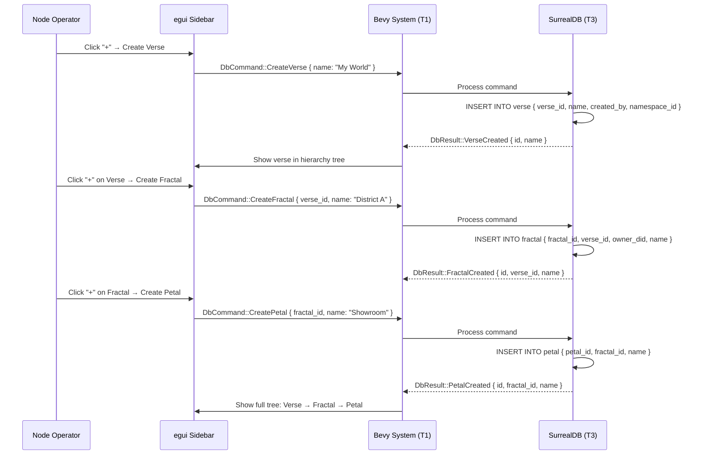
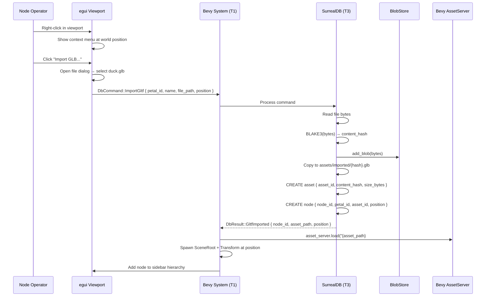
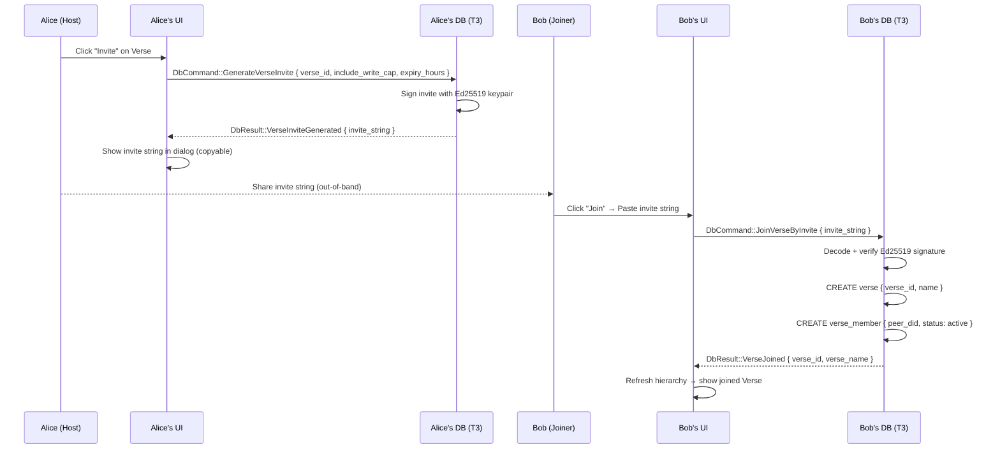
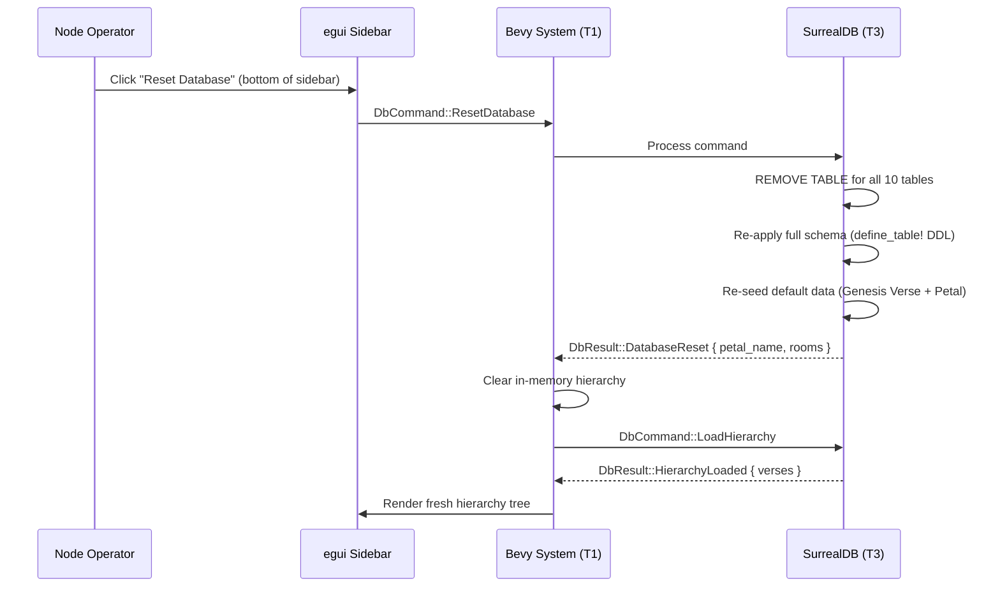
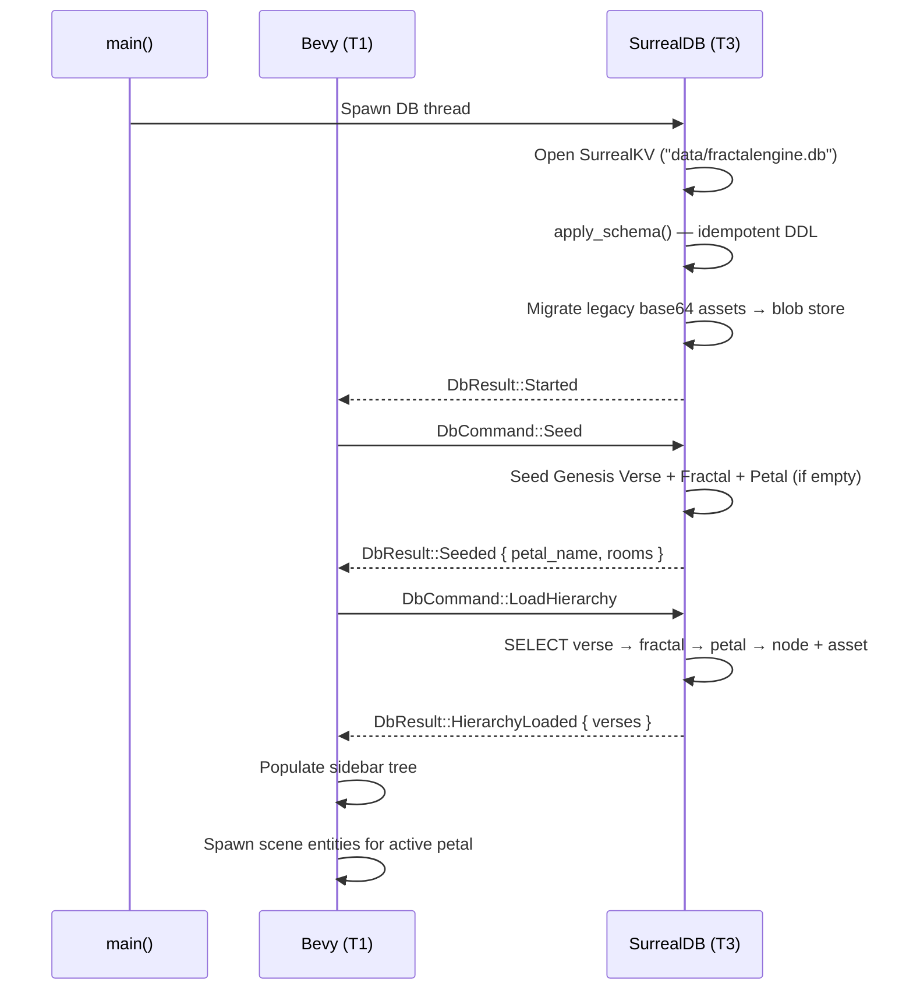

# User Interaction Flow

## End-to-End: Create Verse → Fractal → Petal

## End-to-End: Import GLB Model

## End-to-End: Verse Invite Flow

## End-to-End: Database Reset

## End-to-End: Startup & Hierarchy Load

